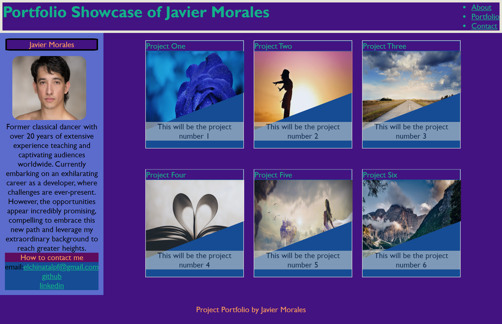

# Second-Week-Porfolio

## Project Portfolio Description
This project is a collection of mini-projects that I am working on to showcase my skills and learn new things. The projects are in various stages of development, but I am constantly adding new ones and updating the existing ones. I am using this project as a way to learn new technologies and to practice my coding skills. I am also hoping to use it as a way to connect with other developers and to get feedback on my work. 

## Tasks Achieved
* The code was built from scratch using inspiration from different sources, the official documentation and the advance CSS bootcamp classes.
* The code has a basic HTML and CSS structure.
* All selectors are organized.
* All the official requirements are met.

## Resources
* All the images are free  of use from https://pixabay.com/
* https://www.w3schools.com/css/default.asp
* https://developer.mozilla.org/en-US/docs/Web/CSS
* I was able to find the free images website through  https://www.webfx.com/

## Deployement
* Webpage link: https://elchinatalpf.github.io/Second-Week-Porfolio/

## License
MIT License

Copyright (c) 2023 elchinatalpf

Permission is hereby granted, free of charge, to any person obtaining a copy
of this software and associated documentation files (the "Software"), to deal
in the Software without restriction, including without limitation the rights
to use, copy, modify, merge, publish, distribute, sublicense, and/or sell
copies of the Software, and to permit persons to whom the Software is
furnished to do so, subject to the following conditions:

The above copyright notice and this permission notice shall be included in all
copies or substantial portions of the Software.

THE SOFTWARE IS PROVIDED "AS IS", WITHOUT WARRANTY OF ANY KIND, EXPRESS OR
IMPLIED, INCLUDING BUT NOT LIMITED TO THE WARRANTIES OF MERCHANTABILITY,
FITNESS FOR A PARTICULAR PURPOSE AND NONINFRINGEMENT. IN NO EVENT SHALL THE
AUTHORS OR COPYRIGHT HOLDERS BE LIABLE FOR ANY CLAIM, DAMAGES OR OTHER
LIABILITY, WHETHER IN AN ACTION OF CONTRACT, TORT OR OTHERWISE, ARISING FROM,
OUT OF OR IN CONNECTION WITH THE SOFTWARE OR THE USE OR OTHER DEALINGS IN THE
SOFTWARE.